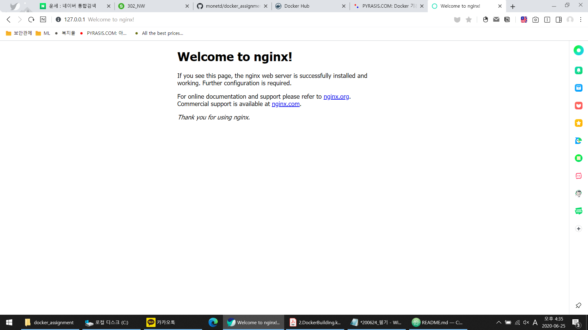

# Docker & Kubernetes Assignment (KT이용재)
---

## Download REPOSITORY from Github
```
git clone https://github.com/monetd/msa.git
```

## Build
- `build.sh`을 실행하여 Build (`Dockerfile`과 동일경로에서 실행)
[](https://asciinema.org/a/343239)

- 생성된 이미지 확인
```
❯ docker images
REPOSITORY                           TAG                                              IMAGE ID            CREATED             SIZE
inverlist/mynginx                    0.1                                              2c06e627312e        46 seconds ago      231MB
```

## Run
- mynginx 라는 이름으로 컨테이너 실행
- 호스트의 8080 포트와 컨테이너의 80포트 연결
- 호스트의 `/Users/iyongjae/workspaces/msa/data` 폴더(생성 필요)와 컨테이너의 `/data` 폴더 연결
```
# docker run --name mynginx -d -p 8080:80 -v /Users/iyongjae/workspaces/msa/data:/data inverlist/mynginx:0.1
```

- 실행 컨테이너 확인
```
❯ docker ps
CONTAINER ID        IMAGE                   COMMAND                  CREATED             STATUS              PORTS                           NAMES
40aa0a8f5e10        inverlist/mynginx:0.1   "nginx"                  11 seconds ago      Up 10 seconds       443/tcp, 0.0.0.0:8080->80/tcp   mynginx
```

## 서비스 확인
- nginx 웹 페이지 접속 (http://127.0.0.1:8080)


