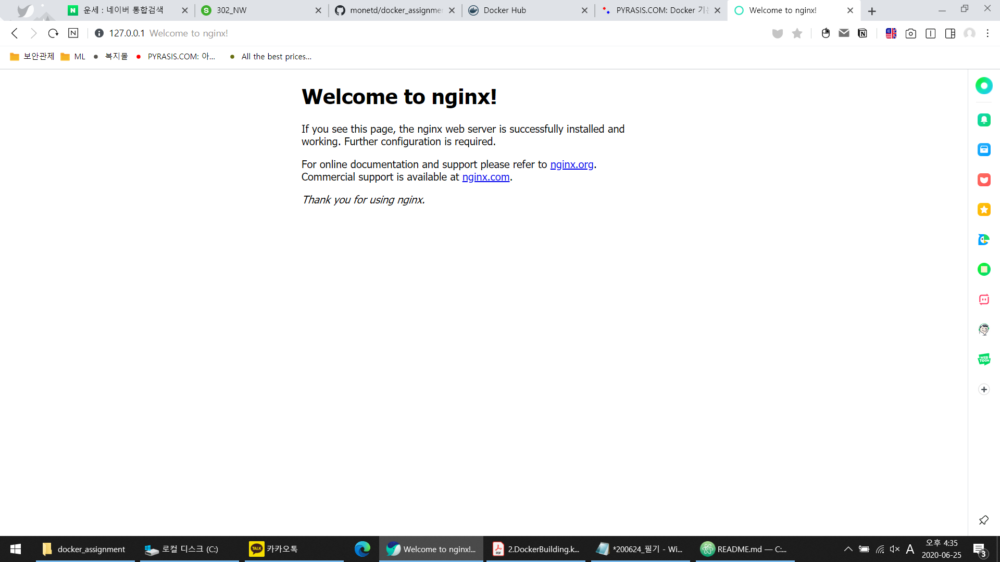

# Docker & Kubernetes Assignment (KT이용재)
---

## Get REPOSITORY
```
git clone https://github.com/monetd/docker_assignment.git
```
or
### Download Image from Dockerhub
```
$ doker pull inverlist/nginx
```

## Build
- `Dockerfile`을 이용하여 Build 한다.
```
$ docker build --tag inverlist/nginx .
```
- 생성된 이미지 확인
```
$ docker images
REPOSITORY                    TAG                 IMAGE ID            CREATED             SIZE
inverlist/nginx               latest              dbb357266645        2 minutes ago       231MB
```

## Run
- mynginx 라는 이름으로 컨테이너 실행
- 호스트의 8080 포트와 컨테이너의 80포트 연결
- 호스트의 `C:\data` 폴더와 컨테이너의 `/data` 폴더 연결
```
# docker run --name mynginx -d -p 8080:80 -v C:\\data:/data inverlist/nginx
```

- 실행 컨테이너 확인
```
$ docker ps
CONTAINER ID        IMAGE               COMMAND             CREATED             STATUS              PORTS                           NAMES
ec88dff2e019        inverlist/nginx     "nginx"             44 seconds ago      Up 42 seconds       443/tcp, 0.0.0.0:8080->80/tcp   mynginx
```

## 서비스 확인
- nginx 웹 페이지 접속 (http://127.0.0.1:8080)

[](https://asciinema.org/a/290796)


